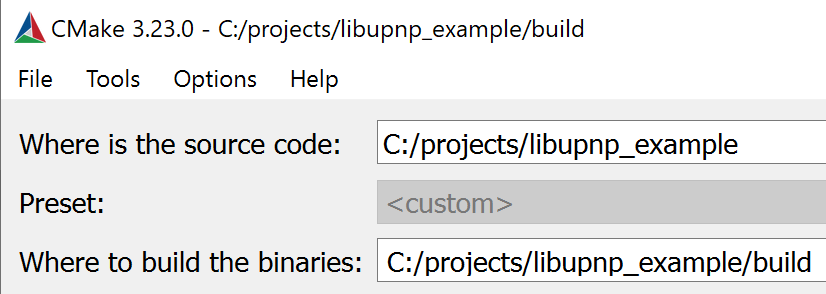
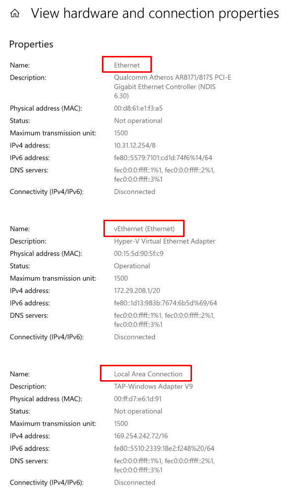

# libupnp_example
An simple application example that use libupnp to list discovered devices using SSDP.  
Windows and Linux are supported.

## Prerequisites

### Linux

Install dependencies with
```bash
% sudo apt install libupnp-dev
```

### Windows

Clone git pupnp repository (https://github.com/pupnp/pupnp) to the folder next to this repository, so they would be on one level (cd ..\pupnp place you in the pupnp folder). Then build pupnp. I do not cover the pupnp build here, considering you know about cmake, Debug/Release targets and 32/x64 architectures.  
After succesful build you will get libupnp.dll, ixml.dll, pthreadVV3.dll and libupnp.lib. Copy libupnp.lib to the root of this repository.
Install cmake-gui. You will need it anyway to build pupnp.
That's all for now.

## Building

### Linux

#### GCC only

Make a build dir and compile with linking of libupnp library:

```bash
% mkdir build
% gcc main.c -o build/libupnp_example -lupnp`
```

#### CMake based

```bash
% mkdir build
% cmake ..
% make
```

### Windows

Open cmake-gui and choose this repository as sources. Then copy-paste the path in the binary output folder and add "\build" in the end. It will look like this:

Run Configure and Generate. Then run build in your build tool.
You will get libupnp_example.exe file. Copy three DLLs from the Prerequisites section of this manual to the folder with the executable file.

## Usage

Usage: `libupnp [interface_name] <timeout_s>`  
When network interface is not set, the first suitable interface is used. When network interface name contains spaces, use double quotes around it.
For example: Run tvdevices server from the pupnp samples. Then running `libupnp_example enp4s0 3` will produce the following output (replace enp4s0 with your interface name):

```
Event: UPNP_DISCOVERY_SEARCH_RESULT
The cookie value is "I am a cookie."
ErrCode     =  0
Expires     =  100
DeviceId    =  uuid:Upnp-TVEmulator-1_0-1234567890001
DeviceType  =  
ServiceType =  
ServiceVer  =  
Location    =  http://<my ip>:49152/tvdevicedesc.xml
OS          =  Linux/4.15.0-193-generic, UPnP/1.0, Portable SDK for UPnP devices/1.14.14
Date        =  Sat, 08 Oct 2022 07:41:35 GMT
Ext         =  
Event: UPNP_DISCOVERY_SEARCH_RESULT
The cookie value is "I am a cookie."
ErrCode     =  0
Expires     =  100
DeviceId    =  uuid:Upnp-TVEmulator-1_0-1234567890001
DeviceType  =  
ServiceType =  
ServiceVer  =  
Location    =  http://<my ip>:49152/tvdevicedesc.xml
OS          =  Linux/4.15.0-193-generic, UPnP/1.0, Portable SDK for UPnP devices/1.14.14
Date        =  Sat, 08 Oct 2022 07:41:35 GMT
Ext         =  
Event: UPNP_DISCOVERY_SEARCH_TIMEOUT
```
It contains three events: 2 DISCOVERY events and one TIMEOUT event. Expect only TIMEOUT event in case no SSDP server is running.

### Windows hints

What is the network interface name in Windows? How do you get it? Why everything needs to be so difficult?  
There is a page called "View hardware and connections properties" in Windows 10. There you will see the names of the interfaces like: Ethernet, vEthernet (Ethernet), vEthernet (Wi-Fi), Local Area Connection, Local Area Connection* 3, Wi-Fi and so on. Yes, these are the correct names. Just don't forget the quotes. Here is the example:  
  
Hint: just disable all interfaces except the one you need for test. Then run libupnp_example with no interface name. It will use the only remaining inteface.  
Tool: There is a script to determine the name of the interface based on its IP address. Find it in tools folder. Usage is `get_if_name_windows <ip_address>`.

## Configuration

Manually tested in the following conditions:  
- pupnp v1.14.14 (https://github.com/pupnp/pupnp/releases/tag/release-1.14.14)

### Linux

- Lubuntu 18.04

### Windows

- Windows 10 10.0.19044
- CMake-gui 3.23
- Visual Studio 2019